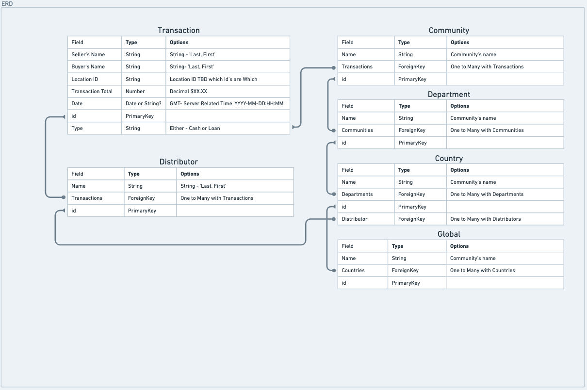

# See-Suite - Team 2 International Aid Hackathon Application (05.03.2022 to 05.05.2022)

## ABOUT
This project was constructed as part of an General Assembly Hackathon for an international aid organization called Unlocking Communities. Unlocking Communities is an organization that "...equips entrepreneurs with the education and tools to sell sustainable products that unlock economic, social, and environmental transformation in their communities." More information about Unlocking Communities can be found [here.](https://unlockingcommunities.org/our-mission/)

The Hackathon parameters were to create an application with at least one feature that tracked some portion of the entrepreneur sales or inventory and represent that data to both C-level executives and local entrepreneur managers in low-bandwidth areas of the world. From an engineering standpoint, we created this coupled application to handle data received by other teams' applications, namely Team 1 - (Android Application Development Team), and represent that data as a tracking software to indicate which communties and entrepreneurs needed additional training and support.

From research to presentation of this application we were given 60 hours to work.

## AWARDS -  🎗 🥈 2nd Place 🥈 🎗

## OUR TEAM

*  
  [Meagan Bleach](https://www.linkedin.com/in/meaganbleach/) - UI/UX Designer
* 
  [Rachel Wynne-Bernstein](https://www.linkedin.com/in/rachelwynnebernstein/) - UI/UX Designer
* 
  [Talon Krell](https://www.linkedin.com/in/talon-krell/) - UI/UX Designer
* 
[Robb Herndon](https://github.com/robbherndon) - Data Scientist
* 
[Najee Simmons](https://github.com/najeesimmons) - Software Engineer
* 
[Haziq Naeem](https://github.com/Haziq12) - Software Engineer
* 
[Bredell Evans](https://github.com/bredy452) - Software Engineer
* 
[Boots Stribling](https://github.com/BootsStribling) - Software Engineer - Scrum Master

## Design
  ### Tech Used

  Images

## Front-End Implementation
  ### Tech Used
   
   
   
   
   
   
  

  * Designed to load quickly and cleanly in low-bandwidth environments, we implemented a pie-chart npm package called [React-Minimal-Pie-Chart](https://www.npmjs.com/package/react-minimal-pie-chart) to make the load weight and time much quicker on the front-end.
  * Accordion style floating nav-bar with buttons to change pie-chart through RESTful API calls to backend for data.

## Back-End Implementation
  ### Tech Used
   
  
  
  

  

  * Using SQLAlchemy and PostGreSQL we implemented a constructive API focusing on transactions as the most elemental level of the represenation
  * We built routes with queries to the PostGreSQL database to allow for summation of transaction totals for representation.
  * The totals were sent in lightweight JSON format. Data was only one array comprising [Transaction Total, Loan Total, Cash Total]

## V2 Expectations
  This project, along with the other 4 teams who participated, was handed to Deloitte as a prototype for them to build the working application with. While we do not know the status of that application, we certainly hope that our time and code was used effectively to the aid of those in the countries it was deployed in. 
